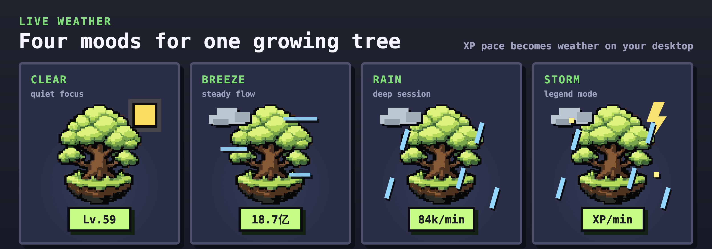
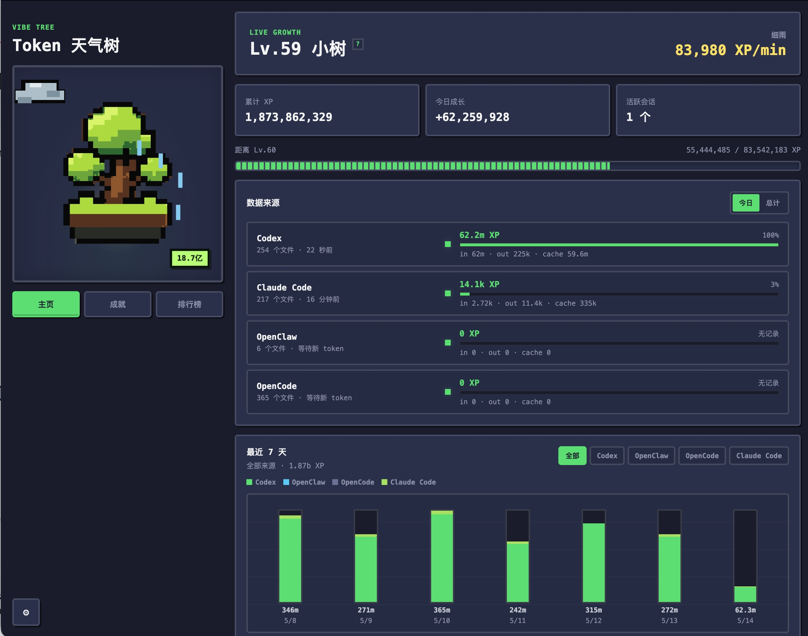

# 🌳 Vibe Tree

[简体中文](README.md) | English

**Every token your coding agent spends grows a little tree on your desktop.**

Vibe Tree is a desktop-resident token weather tree — it turns the cost, rhythm, and activity of vibe coding into a pixel bonsai you can nurture.

<p align="center">
  
</p>

<p align="center">
  
</p>

---

## Quick Start

```bash
npm install
npm start
```

> Works on macOS / Windows / Linux. Dev mode: `npm run dev`

---

## Why Vibe Tree?

### 🌱 Make Coding Feel Alive
A transparent floating window lives on your desktop. The tree grows as tokens are consumed. Total XP determines your level; recent activity drives the weather — the more you code, the more your tree flourishes.

### 📊 See Where Your Tokens Go
The manager panel shows source breakdowns, model ratios, and 7-day charts. View all agents or drill into a single agent's input / output / cache details.

### 🏅 Unlock Legendary Achievements
The built-in achievement system tracks streaks, total usage, and coding rhythm, then celebrates key moments with a small pixel toast.

### 🏆 Compete with Global Vibe Coders
An optional global leaderboard — sign in with GitHub to join. Only daily token totals are uploaded; no code or session content ever leaves your machine.

---

## Supported Agents

| Agent | Status | Data Source |
|-------|--------|-------------|
| Claude Code | ✅ | `~/.claude/projects/**/*.jsonl` |
| Codex | ✅ | `~/.codex/sessions/**/*.jsonl` |
| OpenClaw | ✅ | `~/.openclaw/agents/**/sessions/*.jsonl` |
| OpenCode | ✅ | `~/.local/share/opencode/storage/message/**/*.json` |

Auto-detected on install. Zero configuration required. Source paths can be customized in Settings.

---

## Features

- **Desktop Pet Window** — transparent, always-on-top, draggable, lockable
- **Manager Panel** — level, weather, active sessions, source stats, 7-day charts
- **Level Badge** — 3D flip animation, configurable to show level / total tokens / token/s
- **Global Leaderboard** — GitHub sign-in, join or leave anytime
- **Auto Updates** — checks GitHub for new versions on launch, supports one-click terminal update
- **Bilingual** — switch between Chinese and English in Settings
- **Launch at Startup & Silent Mode** — quietly accompanies your coding sessions

---

## Changelog

See [CHANGELOG.md](CHANGELOG.md).

---

<details>
<summary><strong>📖 XP Rules</strong></summary>

```
XP = inputTokens + outputTokens
```

`cacheReadTokens` / `cacheWriteTokens` are stored for source details but not counted as XP.

By default, tracking starts from install day. Pre-install history is not imported.

</details>

<details>
<summary><strong>🔧 Advanced Configuration</strong></summary>

### Import History

macOS / Linux:

```bash
VIBE_CODEX_IMPORT_HISTORY=today \
VIBE_CLAUDE_IMPORT_HISTORY=today \
VIBE_OPENCLAW_IMPORT_HISTORY=today \
VIBE_OPENCODE_IMPORT_HISTORY=today \
npm start
```

Windows PowerShell:

```powershell
$env:VIBE_CODEX_IMPORT_HISTORY="today"
$env:VIBE_CLAUDE_IMPORT_HISTORY="today"
$env:VIBE_OPENCLAW_IMPORT_HISTORY="today"
$env:VIBE_OPENCODE_IMPORT_HISTORY="today"
npm start
```

### Leaderboard Service

The leaderboard is off by default. Production builds use the deployed Worker. For local testing:

```bash
VIBE_TREE_LEADERBOARD_API_URL=https://your-worker.workers.dev npm start
```

Backend template: `server/leaderboard-worker/`

Privacy: only daily token totals from the last 30 days are uploaded. No prompts, files, sessions, or model info.

</details>

<details>
<summary><strong>🎮 Game Balance</strong></summary>

Growth, weather, and activity windows are configured in:

```
public/assets/trees/vibe-bonsai/config/game-balance.json
```

Includes: XP level curve, weather thresholds, growth stage thresholds, activity window parameters.

</details>

<details>
<summary><strong>💾 Persistence</strong></summary>

Electron stores local data:

- `usage-events.jsonl` — append-only event store
- `usage-meta.json` — install date and metadata
- `device-settings.json` — machine-local settings
- `*-session-watcher.json` — watcher state for each agent

</details>

---

## Product Direction

Vibe Tree is not just a token dashboard. The goal is to make vibe coding's cost and rhythm perceivable through a desktop companion. The first version prioritizes reliable multi-agent local ingestion; future work refines pet behavior, weather feedback, and game balance.

---

## License

MIT
