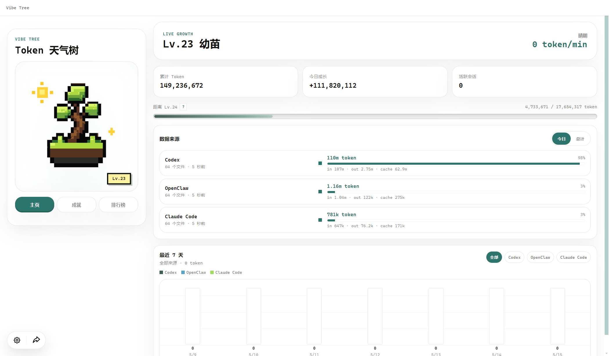
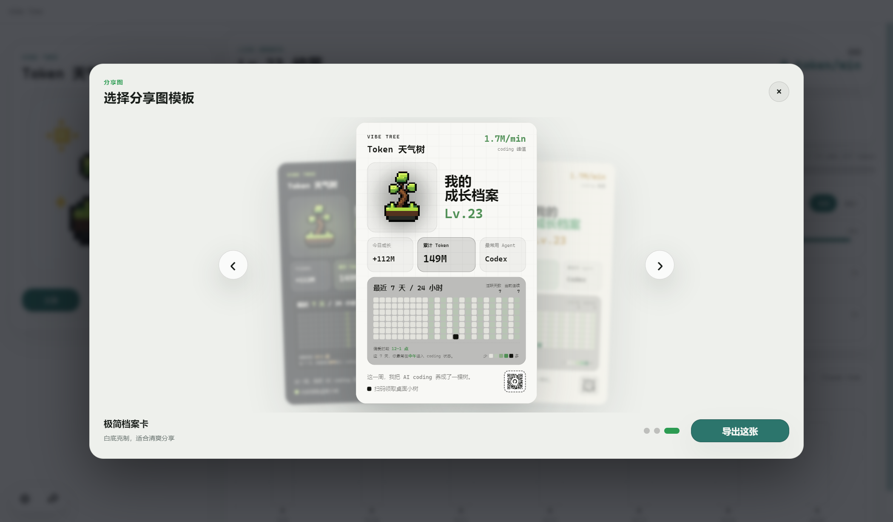
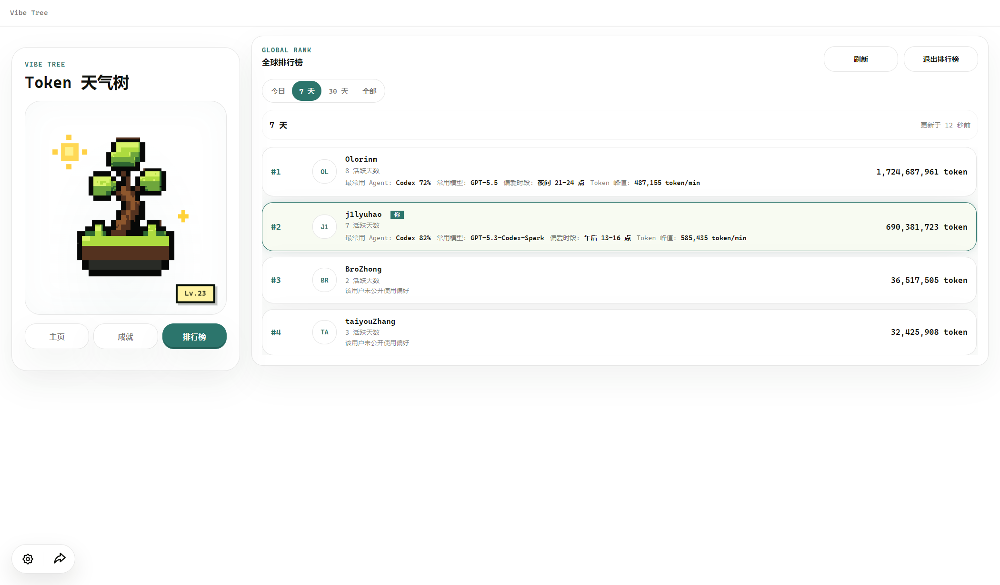

# 🌳 Vibe Tree

简体中文 | [English](README.en.md)

**你的 coding agent 每消耗一个 token，桌面上的小树就长一点。**

Vibe Tree 是一个桌面常驻的 token 天气树。它会读取本地 AI coding agent 的使用记录，把 token 消耗、活跃节奏、模型偏好和连续使用，变成一棵可以养成的像素小树。

它不是传统的 token dashboard，而是把「我今天到底写了多少、什么时候最上头、主要靠哪个 agent」变成一个能看见、能分享、也能轻轻炫耀的桌面体验。

## 产品截图

### 实时成长面板

查看累计 Token、今日成长、等级进度、数据来源和最近 7 天使用趋势。



### 分享成长图

一键生成 3 套分享卡片，展示等级、累计 Token、最常用 Agent、7 × 24 小时热力图和 GitHub 二维码。



### 全球排行榜

可选加入排行榜。默认只公开聚合后的 token 排名；如果用户开启使用偏好公开，才展示最常用 Agent、常用模型、偏爱时段和 token 峰值。



## 核心功能

- **桌面像素树**：常驻桌面，支持置顶、拖动、缩放、锁定位置和静默启动。
- **实时 token 天气**：累计 Token 决定成长等级，当前 token/min 决定天气状态。
- **多 Agent 数据源**：支持 Codex、Claude Code、OpenClaw、Pi Agent、OpenCode、Gemini 和 Hermes。
- **来源与模型统计**：按 agent 查看 input / output / cache，展开后可查看模型占比。
- **多设备同养一棵树**：登录同一个 GitHub 账号后，Windows 和 Mac 可以同步等级、累计 Token、成就、设备贡献和聚合模型占比。
- **最近 7 天图表**：按来源筛选近期 token 使用趋势。
- **成就系统**：记录累计消耗、峰值时刻、连续活跃、时间偏好和 agent 使用里程碑。
- **分享图导出**：从 3 套视觉模板里选择，一键导出高清 PNG。
- **三套 UI 主题**：白天、黑夜、柔和，和分享卡片视觉保持一致。
- **排行榜与隐私控制**：GitHub 登录后可加入全球排行榜，使用偏好公开始终由用户主动开启。
- **中英文界面**：设置面板中可一键切换语言。

## 快速开始

```bash
npm ci
npm start
```

开发模式：

```bash
npm run dev
```

构建检查：

```bash
npm run typecheck
npm run build
```

如果 Electron 二进制从 GitHub 下载较慢，可以临时使用国内镜像：

```bash
ELECTRON_MIRROR=https://npmmirror.com/mirrors/electron/ \
npm_config_electron_mirror=https://npmmirror.com/mirrors/electron/ \
npm ci
```

也可以写入本地 `.npmrc`：

```ini
electron_mirror=https://npmmirror.com/mirrors/electron/
```

## 支持的 Agent

| Agent | 状态 | 默认数据来源 |
| --- | --- | --- |
| Codex | ✅ | `~/.codex/sessions/**/*.jsonl` |
| Claude Code | ✅ | `~/.claude/projects/**/*.jsonl` |
| OpenClaw | ✅ | `~/.openclaw/agents/**/sessions/*.jsonl` |
| Pi Agent | ✅ | `~/.pi/agent/sessions/**/*.jsonl` |
| OpenCode | ✅ | `~/.local/share/opencode/opencode.db`（兼容旧版 `storage/message/**/*.json`） |
| Gemini | ✅ | 本地 Gemini 会话目录 |
| Hermes | ✅ | 本地 Hermes 会话目录 |

安装后会自动检测默认路径。也可以在设置面板里自定义每个 agent 的数据路径，或关闭不想统计的来源。

## 数据与隐私

Vibe Tree 优先做本地统计。默认不会上传代码、提示词、文件名、路径、会话内容或完整小时热力图。

开启「同养一棵树」后，只同步养成所需的数据：token 事件、安全来源分类、设备 id、粗粒度设备摘要、成就状态，以及按天/设备/来源/模型汇总后的 token 数。不会上传单条会话内容、prompt、回复、本地路径或代码文件。

完整数据处理说明见 [PRIVACY.md](PRIVACY.md)。

加入排行榜时，默认只同步每日 token 总量、近 24h 小时级 token 汇总和本地首次使用日期，用于计算近 24h、7 天、30 天和全部榜单。开启「公开使用偏好」后，才会额外上传聚合后的四项信息：

- 最常用 Agent
- 常用模型
- 偏爱时段
- token 峰值

这些信息只用于排行榜展示。

## Token 规则

```text
计入 Token = inputTokens + outputTokens + cacheReadTokens + cacheWriteTokens
```

部分 provider 会把缓存输入包含在 `inputTokens` 里；Anthropic 会单独上报 cache read / write。Vibe Tree 会按每次请求的总 token 消耗计入成长，并对已包含在 `inputTokens` 里的缓存输入只计一次，避免双算。

默认从安装当天开始统计，安装日前的历史不会计入，除非通过环境变量显式导入历史。

## 导入历史数据

macOS / Linux:

```bash
VIBE_CODEX_IMPORT_HISTORY=today \
VIBE_CLAUDE_IMPORT_HISTORY=today \
VIBE_OPENCLAW_IMPORT_HISTORY=today \
VIBE_OPENCODE_IMPORT_HISTORY=today \
npm start
```

Windows PowerShell:

```powershell
$env:VIBE_CODEX_IMPORT_HISTORY="today"
$env:VIBE_CLAUDE_IMPORT_HISTORY="today"
$env:VIBE_OPENCLAW_IMPORT_HISTORY="today"
$env:VIBE_OPENCODE_IMPORT_HISTORY="today"
npm start
```

## 云同步与排行榜服务

线上版本默认使用项目配置的 Cloudflare Worker。自托管或本地调试时可以覆盖：

```bash
VIBE_TREE_LEADERBOARD_API_URL=https://your-worker.workers.dev npm start
```

后端模板在：

```text
server/leaderboard-worker/
```

## Game Balance

成长、天气和活跃窗口由这里配置：

```text
public/assets/trees/vibe-bonsai/config/game-balance.json
```

包含 Token 等级曲线、天气阈值、成长阶段阈值和活跃窗口参数。

## 更新记录

查看 [CHANGELOG.md](CHANGELOG.md)。

## License

MIT
